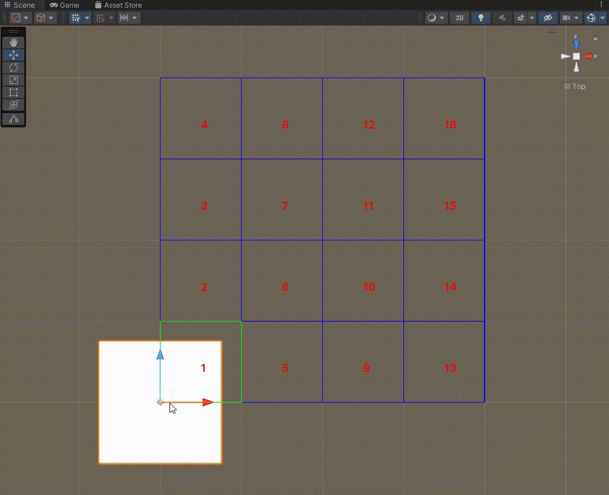

# QuadTrees

High Performance Quad Tree Implementations for C# In Unity (Point, Rect and PointInv). Zero GC optimized.




## Example

### Rect
```
QuadTreeRectF<QTreeObject> qtree = new QuadTreeRectF<QTreeObject>(-100000, 10000, 10000000, 1000000);
qtree.AddRange(new List<QTreeObject>
{
	new QTreeObject(new RectangleF(10,10,10,10)), // Expected result
	new QTreeObject(new RectangleF(-1000,1000,10,10))
});

var list = new List<QTreeObject>();
qtree.GetObjects(new RectangleF(9, 9, 20, 20), list);
```

## Performace


## License

Since version v1.0.3 licensed under the Apache License